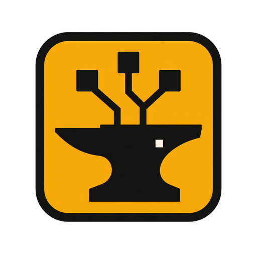
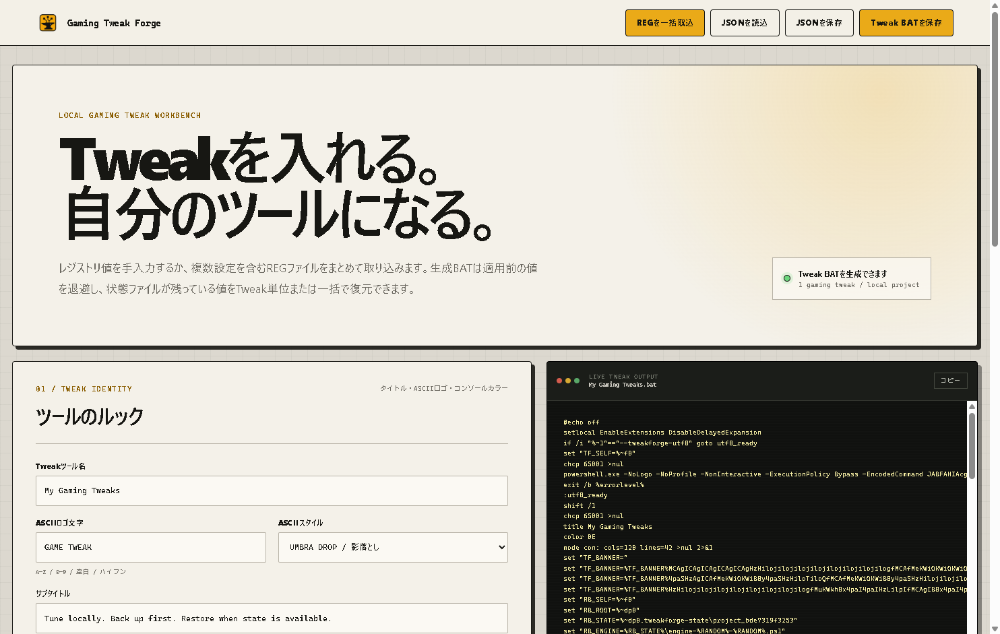

<p align="center">
  
</p>

<h1 align="center">Gaming Tweak Forge</h1>

<p align="center">
  Windows向けの、適用前の値を保存するレジストリTweak BAT作成ツール。<br>
  A local Windows desktop app for building reviewable registry tweak menus with value-level backup and restore routines.
</p>

Gaming Tweak Forgeは、レジストリ設定を手入力または`.reg`ファイルから取り込み、メニュー形式のBATとして書き出すElectronアプリです。適用前の値をTweakごとに保存し、状態ファイルが利用できる値を個別または一括で復元できます。

<p align="center">
  
</p>

## Features

- `HKCU`、`HKLM`、`HKCR`、`HKU`、`HKCC`の値を追加・更新・削除
- `REG_SZ`、`REG_EXPAND_SZ`、`REG_MULTI_SZ`、`REG_BINARY`、`REG_DWORD`、`REG_QWORD`に対応
- 複数の`.reg`ファイルをまとめて取り込み（最大20ファイル、各2MBまで）
- プロジェクトをJSONで保存・再読込
- 生成BATのライブプレビュー、コピー、保存
- Tweak単位または全体の適用・値単位の復元メニュー
- 適用前の値を`.tweakforge-state`へ初回保存
- Windows復元ポイントの作成メニュー
- 4種類のコンソールテーマと5種類のASCIIバナースタイル

## Download

[ReleasesからWindows x64 portable版をダウンロード](https://github.com/Kqgen/registry-menu-builder/releases)

インストールは不要です。配布バイナリはコード署名されていないため、Windowsが警告を表示する場合があります。各Release notesに記載されたSHA-256を確認してください。

## Usage

1. アプリを起動し、Tweakを手入力するか`.reg`ファイルを取り込みます。
2. タイトル、テーマ、ASCIIバナーを調整します。
3. 右側のプレビューで生成内容を確認し、BATを保存します。
4. 生成されたBATを読み、意図した変更だけが含まれていることを確認します。
5. BATを実行し、個別または一括でTweakを適用・復元します。生成BATはUACによる管理者承認を要求し、内蔵PowerShellエンジンを`ExecutionPolicy Bypass`で実行します。

## Safety

生成されたBATはWindowsレジストリを変更します。性能向上や特定ゲームへの効果を保証するものではありません。実行前にBATの内容を確認し、重要なデータをバックアップしてください。

復元は完全なシステム復元ではなく、`.tweakforge-state`に状態が残っている対象値だけに行われます。状態ファイルがない値は復元できず、復元に成功した状態ファイルは削除されます。Tweak適用時に新しく作られた空のレジストリキーは残る場合があります。一括処理は原子的ではないため、一部だけ成功する可能性があります。

`.tweakforge-state`には元のレジストリデータが含まれます。復元が必要な間は削除せず、第三者と共有しないでください。Windowsのシステム保護が無効な環境では、復元ポイントの作成に失敗する場合があります。

本ソフトウェアはMIT Licenseに基づき、無保証で提供されます。正式な条件は[LICENSE](LICENSE)を確認してください。

## Development

Node.jsとnpmを用意し、次のコマンドを実行します。

```powershell
npm ci
npm run dev
```

Electronアプリとして起動する場合は`npm run desktop`を使用します。

```powershell
npm test
npm run build
npm run desktop:smoke
npm run package:win
```

`npm run package:win`はWindows x64 portable実行ファイルを`release/`へ生成します。

## License

[MIT License](LICENSE)
